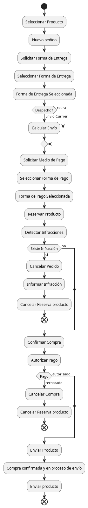

# Trabajo Práctico: "Livre Markket: Comunidad de vendedores y compradores de bienes y/o servicios"

## Descripción del Negocio
Livre Markket es una plataforma de comercio electrónico que conecta a vendedores y compradores de productos y servicios. Los vendedores pueden publicar sus productos, mientras que los compradores buscan, seleccionan y adquieren estos productos mediante un flujo de compra que incluye verificación de cumplimiento de políticas, reserva de productos, validación de pagos y selección de envíos.

## Módulos y Responsabilidades
1. **Web**: Gestiona la interfaz de usuario y maneja la interacción directa con los usuarios (vendedores y compradores), permitiendo realizar búsquedas, visualización de productos y gestión de perfil.
2. **Compras**: Actúa como el concentrador de las operaciones entre el comprador y los servicios internos, coordinando el flujo de transacción.
3. **Envíos**: Calcula costos de envío (dependiendo de si es retiro o envío por correo) y gestiona la logística del envío de productos.
4. **Infracciones**: Evalúa el cumplimiento de las políticas de publicación y detecta posibles infracciones por parte de compradores o vendedores.
5. **Pagos**: Servicio de pago que autoriza o rechaza transacciones.
6. **Publicaciones**: Administra los productos o servicios publicados y gestiona la reserva de los mismos durante el proceso de compra.

## Parte 1: Arquitectura Monolítica Inicial
La primera implementación de Livre Markket emplea una arquitectura **monolítica sincrónica**. Todos los módulos están alojados en una única aplicación, compartiendo recursos y manteniendo una sola base de datos centralizada. Los usuarios interactúan directamente con la aplicación a través del módulo Web, que controla el flujo completo de la compra sincrónicamente, siguiendo estos pasos:

- El comprador selecciona un producto y genera una solicitud de compra.
- La aplicación realiza llamadas secuenciales a los módulos internos (Publicaciones, Infracciones, Envíos y Pagos).
- Si todas las verificaciones son satisfactorias, se confirma la compra y se despacha el producto.

La primer versión de la implementación monolítica respeta el siguiente diagrama de actividades para la transacción de comprar:



En el repositorio git de la asignatura se encuentra la versión base implementada para simular el servidor de **compras**

### Desafíos de la Arquitectura Monolítica
- **Escalabilidad limitada**: Dificultad para escalar módulos individuales.
- **Dependencias fuertes**: La modificación de un módulo impacta a todo el sistema.
- **Baja tolerancia a fallos**: Cualquier fallo en un módulo detiene todo el proceso.

## Actividades propuestas:
1. **Arquitectura**: realizar una descripción de la arquitectura desde la perspectiva de gestión de las comunicaciones. Describa el stack tecnológico utilizado y evalúe las técnicas de programación utilizadas. Por ejemplo: estructurado u orientado a objetos, declarativo o imperativo, jerárquico o modular, etc.
2. **Lógica**: describa la lógica representada en el diagrama de actividades y realice un detalle de las reglas de negocio que se implementan.
3. **Desafíos**: Además de los 3 desafío indicados en la sección anterior, enumere que otros inconvenientes encuentra tanto en el código cómo en la arquitectura planteada. Recuerde lo aprendido en Laboratorio de Programación y Lenguajes.
4. **Refactoring**: enumere al menos 3 actividades de refactoring que llevaría sobre el código, si lo cree necesario fundamente a través de los patrones de refactoring.
5. **Re-ingeniería**: Realice una propuesta, pensando en lo visto en la asignatura hasta este momento de cambios arquitectónicos para superar los desafíos indicados en el punto 3.

---
# Evoluciones Arquitectónicas en la Transacción de Compra
---
# Parte 2: 

## Evolución 1: Sincronía con Paralelización de Tareas
1. **Objetivo**: Mejorar la eficiencia de la compra permitiendo que ciertas operaciones se realicen en paralelo.
2. **Implementación**: Permitir que la solicitud de reserva del producto, la verificación de infracciones, la selección de forma de pago y la selección de forma de envío se ejecuten al mismo tiempo, minimizando tiempos de espera.
3. **Desafíos y Ventajas**:
   - Reducción del tiempo total de transacción.
   - Aumento de complejidad en la coordinación de respuestas.

### Actividades propuestas:
1. **Nuevo diagrama de Actividades**: Usando la herramienta [plantUML](https://plantuml.com/es/) y el fuente inicial de la arquitectura monolítica secuencial, adapte la misma en una nueva versión que contemple la paralelización de actividades. Para ello deberá primero identificar todos los punto de paralelización posibles. 
2. **1º Evolución del código**: realice todos los cambios que crea necesario para realizar la paralelización sugerida en el punto 1. *Sugerencia*: utilice el módulo setTimeout de [nodejs](https://nodejs.org/en), en particular es importante paralelizar las actividades de acuerdo a la arquitectura asincrónica de javascript, en particular al motor de nodejs, especialmente lo que se refiere al event loop. A continuación se facilitan algunos links para ampliar: 
   - [Node.js Architecture: Understanding Node.js Architecture](https://medium.com/@ibrahimlanre1890/node-js-architecture-understanding-node-js-architecture-5fb32879b994)
   - [Introduction to Node.js](https://nodejs.org/en/learn/getting-started/introduction-to-nodejs)
   - [Asynchronous flow control](https://nodejs.org/en/learn/asynchronous-work/asynchronous-flow-control)
   - [Node.js Architecture](https://radixweb.com/nodejs-architecture)
3. **Descripción de la arquitectura nodejs** en función de lo aprendido en el punto 2, realice un resumen de la arquitectura no bloqueante y de eventloop de nodejs (javascript asincrónico) y comente a su criterio porqué cree que es tema de la asignatira (realice correlación de los temas vistos hasta el momento).
4. **Despliegue y pruebas**: realice conclusiones respecto de la diferencia de ejecución entre la versión cero monolítica secuencial y esta nueva versión monolítica asincrónica.

---
# Parte 3:

## Evolución 2: Descomposición en Módulos RESTful + Seguridad
1. **Objetivo**: Transicionar la arquitectura monolítica hacia una **arquitectura de servicios RESTful** donde cada módulo es independiente.
2. **Implementación**: Desplegar cada módulo como un servicio REST, de manera que el módulo de Compras actúe como orquestador, realizando llamadas a cada servicio de forma sincrónica.
3. **Desafíos**:
   - Complejidad en la gestión de fallos, ya que si un servicio no responde, se detiene la transacción completa.

### Actividades propuestas:
1. **Evolución con servidor Web y Compras**: Realice una transición del diagrama de actividades incorporando solamente el servidor web que interactúa con el usuario.
2. **2º Evolución del código**: Modifique el código existente distribuyendo la lógica de negocio entre el servidor web que interactúa con el usuario y en principio selecciona un producto a comprar y responde a seleccionar el medio de pago y la forma de envío. Cómo la propuesta es usando un esquema de comunicación HTTP, se sugiere utilizar para la implementación los módulos:
   - [expressjs](https://expressjs.com/) para administrar los requerimientos HTTP
   - [Axios](https://axios-http.com/es/)
3. **Despliegue y validación**: realice un despliegue de lo realizado y revise lo que sucede en la ejecución. Indique que pasa y que desafíos o inconvenientes se presentan. Que pasa con el esquema de comunicación? cómo sucede? Realice una propuesta de mejoras a tener en cuenta.
4. **Arquitectura distribuida**: Realice una nueva evolución del diagrama, incorporando todos los servicios propuestos (envíos, infracciones, pagos y publicaciones...además de web y compras ya evolucionados) y realice un resumen ejecutivo de las responsabilidades de cada servicio,  indicando, según lo visto hasta ahora en la signatura, qué factores y técnicas deberían intervenir para el análisis. ¿Qué pasa con el esquema de comunicaciones?
5. **Modificación de Arquitectura**: realice todas las modificaciones en docker-compose para la nueva versión de la arquitectura.
6. **3º Evolución del código**: Incorpore ahora toda la distribución con todos los servidores propuestos utilizando HTTP cómo mecanismos de comunicación.
7. **Despliegue y validación**: ejecute la simulación y evalúe lo que pasa en esta nueva versión. ¿Qué inconvenientes se observan? realice un resumen de los desafíos y una propuesta para solucionarlos. ¿Es asincrónico el código?
8. **4º Evolución del código**: Refactoring y solución de los problemas de comunicación. Realice las modificaciones pertinentes para que efectivamente las interacciones de comunicación entre los servidores sean independientes y en paralelo. ¿Qué mecanismo visto en teoría se debe implementar?

## Análisis de Seguridad en Comunicaciones HTTP
Antes de continuar evolucionando la arquitectura, es necesario analizar las implicancias de seguridad del esquema de comunicación HTTP implementado.
### Actividades propuestas
1. **Captura y Análisis de Tráfico de Red:** Utilizando herramientas de análisis de red, realice una captura del tráfico entre los servicios durante la ejecución de transacciones.
   - ¿Es posible identificar las peticiones HTTP entre servicios?
   - ¿Qué información se puede leer en texto plano?
   - Evalúe qué riesgos de seguridad se pueden presentar.

## Evolución 3: Seguridad - Implementación de HTTPS/TLS
1. **Objetivo**: Proteger las comunicaciones entre servicios mediante el cifrado de datos en tránsito, implementando HTTPS/TLS para garantizar confidencialidad e integridad de las transacciones.
2. **Implementación**: Migrar todos los servicios de HTTP a HTTPS, configurando certificados SSL/TLS y estableciendo comunicaciones cifradas extremo a extremo entre todos los componentes de la arquitectura.
3. **Desafíos**:
   - Generación y gestión de certificados SSL/TLS para cada servicio.
   - Validación de certificados en comunicaciones entre servicios.
### Actividades propuestas:
1. **Modificación y Generación de Certificados**
   - Para cada servicio (web, compras, envíos, infracciones, pagos, publicaciones), 
   - Genere: Clave privada RSA de 2048 bits; Certificado autofirmado válido por 365 días
   - Utilice OpenSSL con los siguientes parámetros: -   **Common Name (CN):** nombre del servicio -   **Organization (O):** "Livre Markket" -   **Country (C):** AR 
2. **Despliegue y Validación HTTPS**
   - Verificación inicial: Levante la nueva arquitectura y verifique: - Todos los servicios inician sin errores. - Los logs muestran "HTTPS" en lugar de "HTTP" - Los certificados se cargan correctamente.
   -  Ejecución de transacciones: Ejecute una simulación completa de compras - Verifique que todas las transacciones se completan - Revise los logs para confirmar comunicaciones HTTPS exitosas.
   - Manejo de errores SSL/TLS: Si hay errores: -   ¿Qué errores de certificado aparecen? -   ¿Cómo se resuelven? -   ¿Por qué usamos `rejectUnauthorized: false` en desarrollo? -   ¿Qué debería hacerse en producción?
3. **Captura de Tráfico HTTPS (Segundo Sniffing)**
   - Repita el análisis de tráfico, ahora con HTTPS implementado.
   - **Análisis comparativo:** Examine la captura de tráfico y responda: -   ¿Es posible leer el contenido de las peticiones ahora? -   ¿Qué información es visible en texto plano? -   ¿Qué información está cifrada? -   ¿Se pudo extraer datos sensibles? -   ¿Qué diferencia se observa respecto a HTTP?
4. **Reflexión Final**: Mencione escenarios que HTTPS no previene o resuelve, con esta arquitectura implementada hasta el momento en términos de Seguridad.

## Evolución 4: Seguridad - Implementación Autenticación
Actualmente cualquier servicio puede llamar a cualquier endpoint de cualquier servicio sin identificarse. Los certificados SSL cifran el canal de comunicación, pero no autentican quién está llamando.
Si alguien despliega un servicio malicioso en la misma red Docker, podría llamar directamente a endpoints como https://pagos:6004/pagarProducto o https://compras:6001/confirmarPago sin pasar por el flujo legítimo. Ningún servicio tiene forma de saber si la solicitud viene de un servicio autorizado o de un intruso.
1. **Objetivo**: 
Diseñar e implementar un mecanismo de autenticación entre servicios para que cada servicio pueda verificar que quien lo llama es un servicio conocido y autorizado del sistema.
### Actividades propuestas
1. **Requerimientos funcionales**
   - Si un servicio recibe una llamada de un origen no autorizado, debe rechazarla con una respuesta HTTP apropiada.
   - Si un servicio recibe una llamada de un servicio legítimo del sistema, debe aceptarla y procesarla normalmente.
   - Cada servicio debe poder identificar qué servicio lo está llamando (no solo si es válido, sino quién es).
   - El mecanismo debe funcionar en el entorno Docker existente sin modificar la lógica de negocio (el flujo de compra debe seguir funcionando igual).
2. **Diseño**
Antes de codificar, documentar brevemente la solución propuesta:
   - ¿Qué mecanismo van a usar para autenticar los servicios?
   - ¿Dónde se almacenan las credenciales?
   - ¿Cómo se transmiten en cada llamada HTTP?
   - ¿Dónde y cómo se validan?
3. **Implementación**
Implementar la solución diseñada en la Consigna 1 sobre el proyecto Livre Markket. El flujo completo de compra debe seguir funcionando, pero ahora con autenticación entre servicios.
4. **Prueba de seguridad**
Ejecutar las pruebas necesarias que demuestren lo siguiente:
   - Una llamada sin credenciales debe ser rechazada.
   - Una llamada con credenciales inválidas debe ser rechazada.
   - Una llamada con credenciales válidas debe ser aceptada.
5. **Análisis**
Responder las siguientes preguntas sobre la solución implementada:
Seguridad:
   - ¿Qué sucede si un atacante obtiene acceso a las credenciales de un servicio? 
   - Las credenciales viajan en cada request HTTP. Aunque usamos HTTPS, el proyecto usa rejectUnauthorized: false para los certificados. ¿Qué implicancias de seguridad tiene esto?
   - ¿Las credenciales de su implementación tienen fecha de vencimiento? ¿Qué problema causa que no la tengan (o que la tengan)?
   - Si se necesita cambiar la credencial de un servicio por sospecha de compromiso, ¿qué pasos hay que seguir? ¿Se puede hacer sin interrumpir el sistema?
   - ¿Puede un servicio receptor distinguir cuál servicio lo está llamando? ¿Se podría restringir para que solo ciertos servicios accedan a ciertos endpoints?
   - ¿Qué limitación tiene su implementación respecto a permisos por operación? (Ejemplo: ¿puede un servicio tener permiso de lectura pero no de escritura?)
   - Listar al menos 3 limitaciones concretas de su solución que motivarían buscar un mecanismo más robusto.

## Evolución 5: eguridad — Tokens JWT (HS256)
1. **Objetivo**: Reemplazar el mecanismo de autenticación de la Parte 3.3 por JSON Web Tokens (JWT) firmados con algoritmo HMAC-SHA256 (HS256), de manera que cada servicio genere tokens autocontenidos con información de identidad y tiempo de expiración.
2. **Conceptos Clave**
   - **JWT (JSON Web Token):** Estándar (RFC 7519) que define un formato compacto y autocontenido para transmitir información entre partes como un objeto JSON firmado.
   - **HS256:** Algoritmo de firma simétrica. Se utiliza un **mismo secreto compartido** para firmar y verificar el token.
   - **Claims:** Datos contenidos dentro del token (emisor, expiración, permisos, etc.).
> **Tip:** Un JWT tiene tres partes separadas por puntos: `header.payload.signature`. Pueden decodificar el header y el payload en [jwt.io](https://jwt.io) para inspeccionar su contenido.
3. **Requerimientos Funcionales**
   - Cada servicio debe **generar un JWT** al momento de llamar a otro servicio.
   - El token debe incluir como mínimo: **emisor** (qué servicio lo generó), **fecha de emisión** y **fecha de expiración**.
   - El tiempo de expiración del token debe ser **corto** (por ejemplo, 30 a 60 segundos).
   - El servicio receptor debe **verificar la firma** y **validar que el token no esté expirado** antes de aceptar la llamada.
   - Si el token es inválido, está expirado o no está presente, el servicio debe responder con el código HTTP apropiado.
   - El flujo de compra debe seguir funcionando sin modificar la lógica de negocio.
> **Tip:** La librería `jsonwebtoken` de Node.js permite firmar con `jwt.sign()` y verificar con `jwt.verify()`. 
### actividades propuestas
1. **Diseño**
Antes de codificar, documentar brevemente:
   - ¿Dónde se almacena el secreto compartido para la firma HS256?
   - ¿Qué claims va a incluir el payload del JWT?
   - ¿Cómo se transmite el token en cada llamada HTTP?
   - ¿Cómo se valida en el servicio receptor?
   - ¿Qué tiempo de expiración van a usar y por qué?
> **Tip:** Investigar el header HTTP `Authorization: Bearer <token>` como forma estándar de transmitir tokens.
2. **Implementación**
Implementar la solución diseñada en la Actividad 1 sobre el proyecto Livre Markket, reemplazando el mecanismo de autenticación de la Parte 3.3.
> **Tip:** El middleware de validación ahora debe verificar la firma del JWT y extraer los claims, en lugar de buscar una clave en un archivo.
3. **Prueba de Seguridad**
Ejecutar y documentar las pruebas necesarias que demuestren que:
   - Una llamada **sin token** es rechazada.
   - Una llamada con un **token expirado** es rechazada.
   - Una llamada con un **token firmado con un secreto diferente** es rechazada.
   - Una llamada con un **token válido y vigente** es aceptada.
   - **Modificar el payload** de un token válido (por ejemplo, cambiar el emisor) y verificar que el servicio lo rechaza.
> **Tip:** Para generar un token expirado en el script de prueba, pueden firmarlo con una expiración de 1 segundo y esperar antes de usarlo.
4. **Análisis**
   - ¿Qué información viaja dentro del JWT que antes no viajaba con el mecanismo de la Parte 3.3? ¿Qué ventaja concreta aporta esto?
   - ¿El servicio receptor necesita consultar alguna base de datos o archivo externo para validar el token? ¿Por qué?
   - ¿Qué mejora aporta la expiración del token respecto al mecanismo anterior? ¿Qué pasa si un token es interceptado?
   - ¿Cuántos servicios conocen el secreto de firma en su implementación? ¿Qué pasa si uno de ellos es comprometido?
   - Con HS256, cualquier servicio que pueda **verificar** un token también puede **generar** tokens válidos. ¿Qué riesgo implica esto? ¿Cómo se podría separar la capacidad de firmar de la capacidad de verificar?
   - Listar al menos 3 limitaciones de JWT con HS256 que motivarían buscar una solución con firma asimétrica (RS256).

## Evolución 6: Seguridad — Tokens JWT (RS256)
En la Parte 3.4 implementaron JWT con firma simétrica (HS256). Si bien resolvió problemas de la etapa anterior — tokens autocontenidos, con expiración y con información del emisor — el secreto compartido introduce un riesgo: cualquier servicio que pueda verificar un token también puede generar tokens válidos. Si un solo servicio es comprometido, el atacante puede emitir tokens haciéndose pasar por cualquier otro servicio.
1. **Objetivo:** Migrar la firma de los JWT de **HS256 (simétrica)** a **RS256 (asimétrica)**, de manera que cada servicio firme con su **clave privada** y los demás verifiquen con su **clave pública**. Esto separa la capacidad de emitir tokens de la capacidad de validarlos.
2. **Conceptos Clave:**
   - **RS256:** Algoritmo de firma asimétrica. El emisor firma con su clave privada; el receptor verifica con la clave pública del emisor.
   - **Clave privada:** Solo la conoce el servicio que firma. Nunca se comparte.
   - **Clave pública:** Se distribuye a todos los servicios que necesitan verificar tokens de ese emisor.
> **Tip:** Pueden generar un par de claves RSA con OpenSSL:
> ```
> openssl genrsa -out private.key 2048
> openssl rsa -in private.key -pubout -out public.key
> ```
3. **Requerimientos Funcionales:**
   - Cada servicio debe tener su **propio par de claves** (privada + pública).
   - Al llamar a otro servicio, debe firmar el JWT con **su clave privada**.
   - El servicio receptor debe verificar el token usando la **clave pública del emisor**.
   - Se deben mantener los claims de la Parte 3.4 (emisor, fecha de emisión, expiración).
   - El flujo de compra debe seguir funcionando sin modificar la lógica de negocio.
### Actividades Propuestas
1. **Diseño:** Antes de codificar, documentar brevemente:
   - ¿Cómo se generan y distribuyen las claves de cada servicio?
   - ¿Dónde se almacena la clave privada de cada servicio? ¿Y las claves públicas de los demás?
   - ¿Qué cambia en el middleware de verificación respecto a la Parte 3.4?
   - ¿Cómo sabe el receptor qué clave pública usar para verificar un token?
> **Tip:** El claim `iss` (issuer) del JWT indica quién emitió el token. El receptor puede usar ese valor para seleccionar la clave pública correspondiente.
2. **Implementación:** Implementar la solución diseñada en la Actividad 1 sobre el proyecto Livre Markket, reemplazando la firma HS256 de la Parte 3.4 por RS256.
> **Tip:** En `jsonwebtoken`, la firma RS256 se usa pasando `{ algorithm: 'RS256' }` tanto en `jwt.sign()` como en `jwt.verify()`. La clave privada y pública se leen como strings con `fs.readFileSync()`.
3. **Pruebas:** Ejecutar y documentar las pruebas necesarias que demuestren que:
   - Una llamada con un token **firmado con una clave privada desconocida** es rechazada.
   - Una llamada con un token **firmado con la clave privada de un servicio pero con el claim `iss` de otro** es rechazada (la clave pública no coincide).
   - Una llamada con un **token válido firmado con la clave privada correcta** es aceptada.
   - **Comprometer la clave pública** de un servicio no permite generar tokens válidos (a diferencia de HS256 donde comprometer el secreto sí lo permitía).
4. **Análisis:**
   - ¿Qué mejora concreta aporta RS256 sobre HS256 en cuanto a la separación de responsabilidades (firmar vs. verificar)?
   - Si un servicio receptor es comprometido, ¿el atacante puede generar tokens válidos haciéndose pasar por otro servicio? ¿Por qué? Comparar con lo que pasaba en HS256.
   - ¿Cuántos pares de claves existen en el sistema? ¿Cuántas claves públicas necesita conocer cada servicio receptor?
   - Si se agrega un nuevo servicio, ¿qué se necesita distribuir a los demás servicios? ¿Y si se necesita revocar un servicio comprometido?
   - Cada servicio genera y firma sus propios tokens. ¿Existe una autoridad central que decida quién puede emitir tokens y con qué permisos? ¿Qué problemas causa esta falta de centralización?
   - ¿Cómo se manejan actualmente los permisos o scopes? ¿Cada servicio decide por su cuenta qué claims aceptar?
   - Listar al menos 3 limitaciones de esta solución que motivarían delegar la emisión de tokens a un **servidor de autorización centralizado** (como en OAuth2).

## Evolución 7: Seguridad — OAuth2 (Diseño y Análisis)
1. **Objetivo:** Analizar críticamente la implementación realizada en las partes anteriores, investigar el protocolo OAuth2 (flujo Client Credentials), y diseñar una propuesta de evolución para Livre Markket que delegue la emisión de tokens a una autoridad central.

### Actividades
1. **Análisis de la solución actual:** Partiendo de **su propia implementación** de la última evolución de seguridad, responder:
   - ¿Quién firma los tokens en su implementación actual? ¿Quién decide qué servicios pueden emitir tokens?
   - Si un servicio de su sistema es comprometido, ¿qué alcance tiene el daño? ¿El atacante puede hacerse pasar por otros servicios? Justificar en base a cómo funciona su código.
   - Si necesitan agregar un nuevo servicio al sistema, ¿qué pasos deben realizar? ¿Hay que intervenir los servicios existentes?
   - Si necesitan revocar el acceso de un servicio comprometido, ¿cómo lo harían?
   - Identificar al menos **3 debilidades concretas** de su implementación actual que justifiquen buscar una solución con autoridad centralizada.
2. **Propuesta de evolución con OAuth2:** Investigar el flujo **OAuth2 Client Credentials** (RFC 6749, Sección 4.4) y elaborar una propuesta de evolución para Livre Markket. La propuesta debe incluir:
   -Diagrama de arquitectura** que muestre los 6 servicios existentes, el servidor de autorización como componente nuevo, y las interacciones entre ellos.
   - Descripción paso a paso** del flujo de autenticación en una llamada concreta (por ejemplo: `compras` llama a `infracciones`), indicando:
      - ¿Cómo obtiene el emisor un token?
      - ¿Cómo lo transmite al receptor?
      - ¿Cómo lo verifica el receptor?
      - ¿Contra qué clave verifica y cómo la obtiene?
   - Responder las siguientes preguntas sobre la propuesta:**
      - ¿Qué componentes de su implementación actual dejarían de ser necesarios? (archivos, claves, variables de entorno, middleware, etc.)
      - ¿Qué componentes se modificarían y cómo?
      - ¿Qué claims adicionales podría incluir un servidor de autorización en los tokens que su implementación actual no tiene? ¿Para qué servirían?
      - ¿Cómo se resolvería la distribución de claves públicas de forma automática, sin copiar archivos manualmente?
      - ¿Conviene que cada servicio solicite un token nuevo en cada llamada o debería cachearlo? ¿Qué criterio usarían para renovarlo?
      - El servidor de autorización se convierte en un componente del cual depende todo el sistema. ¿Qué pasa si se cae? Proponer al menos una estrategia de mitigación.
3. **Análisis comparativo y cierre:**
   - La centralización que propone OAuth2 resuelve varias limitaciones de las etapas anteriores. ¿Introduce nuevos riesgos? Mencionar al menos dos.
   - ¿Qué limitaciones tendría todavía su propuesta para un entorno de producción real? Listar al menos tres.
   - Investigar brevemente qué es **OpenID Connect (OIDC)** y en qué se diferencia de OAuth2. ¿En qué escenario del sistema Livre Markket podría ser útil?

---
# Parte 4:

## Evolución 8: Comunicación Asincrónica mediante Mensajería Distribuida
1. **Objetivo**: Hacer la arquitectura más robusta mediante la comunicación **asincrónica**, utilizando un sistema de mensajería que permita una arquitectura con "smart endpoint and dumb pipes".
2. **Implementación**: Configurar los servicios de Envíos, Pagos e Infracciones para que reciban mensajes de Compras y respondan de manera asincrónica, permitiendo la disponibilidad de todos los módulos incluso si uno de ellos falla momentáneamente.
3. **Desafíos**:
   - Coordinación de mensajes y procesamiento de respuestas en tiempos diferentes.
   - Cambios en la lógica de Compras para manejar respuestas de múltiples servicios en paralelo.

## Actividades propuestas:
1. **Mirando en perspectiva**: Evalúe lo realizado hasta aquí y resuma las técnica vistas usadas hasta el momento. ¿Que está pasando con mi sistema en esta situación? ¿Qué calidad de servicio se está brindando? enumere nuevamente los desafíos y realice las propuestas respectivas para la nueva evolución del código.

---
# Parte 5:

## Evolución 9: Asincronía con Desdoblamiento de Mensajes y Coreografía Mediante Broker
1. **Objetivo**: Mejorar la administración de mensajes y centralizar su distribución mediante un **broker de mensajería** (ej. RabbitMQ o Kafka).
2. **Implementación**: Configurar colas específicas para cada evento y establecer flujos coreografiados donde los servicios reaccionan ante eventos sin la necesidad de una orquestación central.
3. **Desafíos**:
   - Implementación de lógica distribuida y configuración avanzada del broker.
   - Sincronización y consistencia de los datos debido a la independencia de cada servicio en el flujo coreografiado.

## Actividades propuestas:
1. **Arquitectura con RabbitMQ**: Proponga que adaptaciones habría que realizar en la Arquitectura (usando docker) para contener ahora además un servidor de RabbitMQ.
2. **Implementando Arquitectura** Implemente las modificaciones propuestas en el punto 1 y verifique los resultados.
3. **Cambio del esquema de comunicaciones**: realice un resumen de los principales cambios requeridos para pasar de una comunicación punto a punto con express y axios a una comunicación mediante broker con RabbitMQ.
4. **6º Evolución del código**: implemente todos los cambios requeridos para pasar de la comunicación punto a punto a una comunicación con concentrador.
5. **Despliegue y validación**: realice la puesta en marcha y compruebe el nuevo funcionamiento. ¿Qué cambios se observan? ¿que mejoras se logran? ¿que pasa con la tolerancia fallos?
6. **7º Evolución del Código SAGAS**: Si bien a esta altura las comunicaciones cuentan con mensajería desdoblada y asincrónica, revise el negocio y genere un nuevo código más robusto y tolerante a fallos, no sólo desde la perspectiva de la infraestructura sino además desde la perspectiva del negocio, produciendo un código con recuperación total. 
7. **Documentación transaccional**: Realice el resumen de todo el flujo transaccional con su flujo positivo y todo el esquema de transacciones compensatorias requeridos. Realice una conclusión respecto de la complejidad y de la mantenibilidad y realice una prepuesta que mejore los desafíos planteados.
8. **8º Evolución del código CQRS**: realice una propuesta de implementación de "Command Query Responsibility Segregation" para evaluar que pasa con una compra determinada en cada servidor. A esta altura muy probablemente ya haya implementado un mecanismo de persistencia de las compras en cada servidor. Sii no lo ha realizado, es momento de hacerlo.
9. **Recapitulación**: Realice una evaluación de lo realizado hasta ahora y determine y describa todo lo que estaría haciendo falta para llegar a una aplicación de uso profesional.

---
# Parte 6:

## Evolución 10: Migración a ESB con Orquestación Mediante BPM/BPEL
1. **Objetivo**: Integrar un **Bus de Servicios Empresariales (ESB)** para centralizar y controlar el flujo de mensajes mediante orquestación.
2. **Implementación**: Configurar un motor BPM o BPEL que gestione la orquestación de cada paso en la compra, permitiendo reglas de negocio avanzadas y un manejo centralizado de los servicios.
3. **Desafíos**:
   - Complejidad en el mantenimiento y escalabilidad de la arquitectura.
   - Configuración de políticas de enrutamiento en el ESB para maximizar eficiencia y minimizar latencias.

## Actividades propuestas:
1. **Arquitectura con ESB**: Proponga que adaptaciones habría que realizar en la Arquitectura (usando docker) para contener ahora además un servidor ESB. Se propone usar [WSO2 Enterprise Integrator](https://ei.docs.wso2.com/en/latest/)
2. **Implementando Arquitectura** Implemente las modificaciones propuestas en el punto 1 y verifique los resultados.
3. **Cambio del esquema de comunicaciones**: realice un resumen de los principales cambios requeridos para pasar de una comunicación mediante broker con RabbitMQ a una orquestación con concentrador usando ESB. Es importante no proponer usar ESB cómo si fuera un broker (coreografía) sino cómo orquestador.
4. **9º Evolución del código BPM**: Si bien WSO2 no soporta de forma estándar el concepto de orquestación mediante BPM o BPEL, utilice los mecanismos estándar para transferir la lógica de coordinación que estaba (especialmente en compras) distribuida entre los servidores a un orquestador centralizado.
5. **Despliegue y validación**: realice la puesta en marcha y compruebe el nuevo funcionamiento. ¿Qué cambios se observan? ¿que mejoras se logran? ¿que pasa con la tolerancia fallos?
6. **Implementando Seguridad**: Realice una propuesta para incorporar esquema de comunicaciones y ejecución segura con autenticación, autorización y no repudio.
7. **10º Evolución del código**: Implemente los cambios propuestos en el punto anterior.
8. **Recapitulación**: realice una puesta en valor de todo lo realizado hasta el momento y nuevamente evalúe que otros aspectos estarían faltando para poder desplegar una aplicación profesional.
9. **Conclusiones finales**: realice un resumen de todo lo actuado y resuma los desafíos resueltos y las complejidades de los sistemas distribuidos orientados a los servicios.